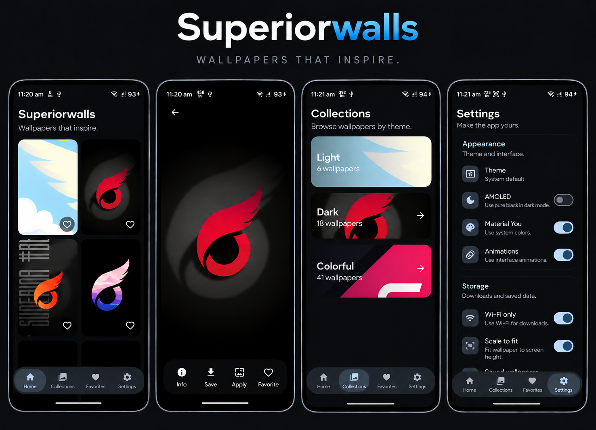

<p align="center">
  
</p>

<h1 align="center">Superiorwalls</h1>

<p align="center">
  <strong>Beautiful wallpapers. Simple experience.</strong><br>
  A modern Android wallpaper app built with Kotlin and Jetpack Compose.
</p>

<p align="center">
  
  
  
  
</p>

---

## ✨ Features

- 🖼️ Browse wallpapers with lightweight previews
- 📚 Explore wallpapers by collections and themes
- ❤️ Save wallpapers to Favorites
- 👀 Open wallpapers in a full-screen viewer
- 📲 Apply wallpapers to Home screen, Lock screen, or both
- 💾 Save wallpapers to the device
- 🔗 Share wallpaper URLs
- 📥 Import images through Android image intents
- 🎨 Material You and dynamic theming
- 🌙 System, light, dark, and AMOLED themes
- ✨ Configurable interface animations
- 📦 Room-backed local caching for offline browsing
- 🔄 Pull-to-refresh
- 📱 Adaptive navigation for phones and tablets
- 🔤 Custom Plus Jakarta Sans and Syne typography

## 📸 Screenshots

<p align="center">
  
</p>

## 🧰 Tech Stack

- **Kotlin**
- **Jetpack Compose**
- **Material 3**
- **AndroidX**
- **Room** for local caching
- **Coil** for image loading
- **Retrofit + Gson** for wallpaper data
- **KSP** for code generation
- **Gradle**

## 🚀 Quick Start

### Requirements

- Android Studio
- JDK 17
- Android SDK 37
- Android 8.0 (API 26) or newer

### Clone

```bash
git clone https://github.com/Darkstar085/Superiorwalls.git
cd Superiorwalls
```

### Build

The repository includes the Gradle wrapper.

```bash
./gradlew assembleDebug
```

For a release build:

```bash
./gradlew assembleRelease
```

The generated APK is placed under `app/build/outputs/apk/`.

## 📦 Releases

Download the latest APK from the repository's Releases page.

## 🤝 Contributing

Contributions, bug reports, and improvements are welcome. Please keep changes focused and follow the existing Kotlin and Jetpack Compose conventions.

## 📄 License

Superiorwalls is licensed under the [MIT License](LICENSE).

---

<p align="center">
  <strong>Superiorwalls</strong> — Make your screen yours.
</p>
